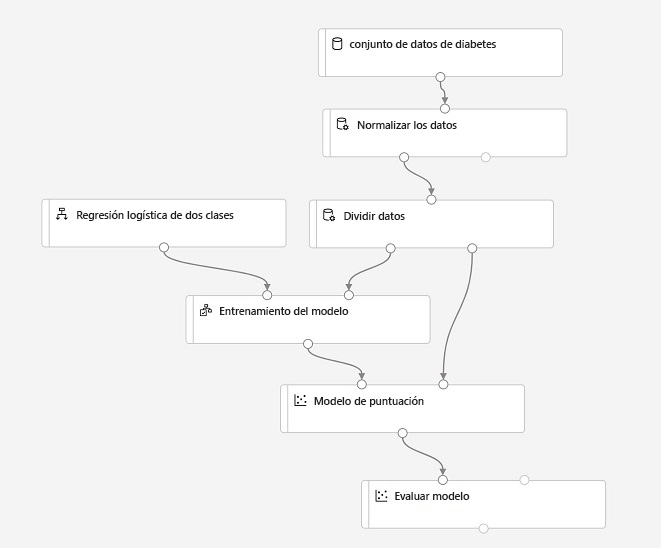
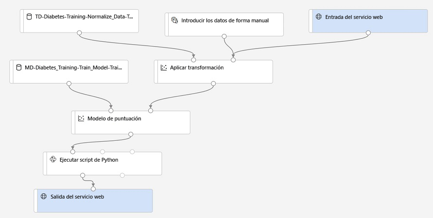

---
lab:
  title: Usar el diseñador de Azure Machine Learning
ms.openlocfilehash: 55911fdc4ea7e3a2b48ab0d0a583a0a24121ffca
ms.sourcegitcommit: d2354e40eec31c22eb09381c6a890311cccc30c9
ms.translationtype: HT
ms.contentlocale: es-ES
ms.lasthandoff: 06/11/2022
ms.locfileid: "146266852"
---
# <a name="use-azure-machine-learning-designer"></a>Usar el diseñador de Azure Machine Learning

El *diseñador* de Azure Machine Learning proporciona un entorno de arrastrar y colocar en el que puede definir un flujo de trabajo o una *canalización* de componentes de entrenamiento de ingesta, transformación y modelo de datos para crear un modelo de aprendizaje automático. A continuación, puede publicar esta canalización como un servicio web que las aplicaciones cliente pueden usar para la *inferencia* (generando predicciones a partir de datos nuevos).

## <a name="before-you-start"></a>Antes de empezar

Si todavía no lo ha hecho, complete el ejercicio *[Creación de un área de trabajo de Azure Machine Learning](01-create-a-workspace.md)* para crear un área de trabajo y una instancia de proceso de Azure Machine Learning y clone los cuadernos necesarios para completarlo.

## <a name="configure-compute-resources"></a>Configurar recursos de proceso

Para usar el diseñador de Azure Machine Learning, necesita un proceso en el que ejecutar el experimento de entrenamiento del modelo.

1. Inicie sesión en [Azure Machine Learning Studio](https://ml.azure.com?azure-portal=true) con las credenciales de Microsoft asociadas a su suscripción de Azure y seleccione su área de trabajo de Azure Machine Learning.
2. En Azure Machine Learning Studio, consulte la página **Proceso** y, en la pestaña **Instancias de proceso**, inicie la instancia de proceso si aún no se está ejecutando. Usará esta instancia de proceso para probar el modelo entrenado.
3. Mientras se inicia la instancia de proceso, cambie a la pestaña **Clústeres de proceso**. Si aún no tiene ningún clúster de proceso, agregue un nuevo clúster de proceso con la siguiente configuración. Usará este clúster para ejecutar la canalización de entrenamiento.
    - **Región:** *la misma región que el área de trabajo*
    - **Prioridad de la máquina virtual**: dedicada
    - **Tipo de máquina virtual**: CPU
    - **Tamaño de la máquina virtual**: Standard_DS11_v2
    - **Nombre del proceso**: *escriba un nombre único*
    - **Número mínimo de nodos**: 0
    - **Número máximo de nodos**: 2
    - **Segundos de inactividad antes de la reducción vertical**: 120
    - **Habilitar acceso SSH**: no seleccionado

## <a name="review-the-training-dataset"></a>Revisar el conjunto de datos de entrenamiento

Ahora que tiene algunos recursos de proceso que puede usar para ejecutar una canalización de entrenamiento, necesitará algunos datos para entrenar el modelo.

1. En Azure Machine Learning Studio, vea la página **Conjuntos de datos**. Los conjuntos de datos representan archivos de datos o tablas específicos con los que tiene previsto trabajar en Azure Machine Learning.
2. Si ha creado previamente el **conjunto de datos de diabetes**, ábralo. De lo contrario, cree un conjunto de datos a partir de archivos web con los valores siguientes y ábralo a continuación:
    * **Información básica**:
        * **Dirección URL web**: https://aka.ms/diabetes-data
        * **Nombre**: conjunto de datos de diabetes
        * **Tipo de conjunto de datos**: tabular
        * **Descripción**: datos de diabetes
    * **Configuración y vista previa**:
        * **Formato de archivo**: delimitado
        * **Delimitador**: coma
        * **Codificación**: UTF-8
        * **Encabezados de columna**: use encabezados del primer archivo.
        * **Omitir filas**: ninguno
    * **Esquema**:
        * incluir todas las columnas que no sean **Ruta de acceso**
        * Revisar los tipos detectados automáticamente
    * **Confirmación de detalles**:
        * no generar perfil de este conjunto de datos después de su creación

4. Consulte la página **Explorar** para ver un ejemplo de los datos. Estos datos representan los detalles de los pacientes que se han sometido a pruebas de diabetes y los usará para entrenar un modelo que prediga la probabilidad de que un paciente resulte positivo de diabetes según las medidas clínicas.

## <a name="create-a-designer-pipeline"></a>Crear una canalización de diseñador

Para empezar a trabajar con el diseñador, primero debe crear una canalización y agregar el conjunto de datos con el que quiere trabajar.

1. En Azure Machine Learning Studio, vea la página **Diseñador** y cree una canalización.
2. Cambie el nombre de canalización predeterminado (**Pipeline-Created-on-* date***) a **Entrenamiento visual de Diabetes** haciendo clic en el icono **&#9881;** de la derecha para abrir el panel **Configuración**.
3. Observe que tendrá que especificar un destino de proceso en el que ejecutar la canalización. En el panel **Configuración**, haga clic en **Seleccionar destino de proceso** y seleccione su clúster de proceso.
4. En el lado izquierdo del diseñador, seleccione la pestaña **Datos** y arrastre el **conjunto de datos de diabetes** al lienzo.
5. Seleccione el componente **conjunto de datos de diabetes** en el lienzo. A continuación, haga clic con el botón derecho en él y elija **Vista previa de los datos**.
6. En el panel DatasetOutput, seleccione la pestaña **Perfil**.
7. Revise el esquema de los datos y observe que puede ver las distribuciones de las distintas columnas como histogramas. A continuación, cierre la visualización.

## <a name="add-transformations"></a>Agregar transformaciones

Para poder entrenar un modelo, normalmente es necesario aplicar algunas transformaciones de preprocesamiento a los datos.

1. En el panel de la izquierda, seleccione la pestaña **Componente**, que contiene una amplia variedad de componentes que puede usar para transformar los datos antes de entrenar el modelo. Puede buscar componentes en la parte superior del panel.
2. Busque el componente **Normalizar datos** y arrástrelo al lienzo, debajo del componente **conjunto de datos de diabetes**. Después, conecte la salida del componente **conjunto de datos de diabetes** a la entrada del módulo **Normalizar datos**.
3. Seleccione el componente **Normalizar datos** y vea su configuración; recuerde que tendrá que especificar el método de transformación y las columnas que se van a transformar. A continuación, deje la transformación como **ZScore** y edite las columnas para que incluyan los siguientes nombres de columna:
    * PlasmaGlucose
    * DiastolicBloodPressure
    * TricepsThickness
    * SerumInsulin
    * BMI
    * DiabetesPedigree

    **Nota**: Estamos normalizando las columnas numéricas para colocarlas en la misma escala y evitar columnas con valores grandes que dominen el entrenamiento del modelo. Normalmente, aplicaría un conjunto completo de transformaciones de preprocesamiento como este a fin de preparar los datos para el entrenamiento, pero en este ejercicio se simplificará el proceso.

4. Ahora estamos listos para dividir los datos en conjuntos de datos independientes para el entrenamiento y la validación. En el panel de la izquierda, busque el componente **Dividir datos** y arrástrelo al lienzo bajo el componente **Normalizar datos**. Después, conecte la salida *Conjunto de datos transformado* (izquierda) del componente **Normalizar los datos** a la entrada del componente **Dividir datos**.
5. Seleccione el componente **Dividir datos** y configure sus valores como se indica a continuación:
    * **Modo de división** Dividir filas
    * **Fracción de filas del primer conjunto de datos de salida**: 0,7
    * **Valor de inicialización aleatorio**: 123
    * **División estratificada**: falso

## <a name="add-model-training-components"></a>Incorporación de componentes de entrenamiento del modelo

Con los datos preparados y divididos en conjuntos de datos de entrenamiento y validación, está listo para configurar la canalización para entrenar y evaluar un modelo.

1. Busque el componente **Entrenar modelo** y arrástrelo al lienzo, en el componente **Dividir datos**. Después, conecte la salida de *Conjunto de datos de resultados 1* (izquierda) del componente **Dividir datos** a la entrada *Conjunto de datos* (derecha) del componente **Entrenar modelo**.
2. El modelo que se va a entrenar predecirá el valor **Diabético/a**, por lo que debe seleccionar el componente **Entrenar modelo** y modificar su configuración para establecer la **columna Etiqueta** en **Diabético/a** (con la misma ortografía y mayúsculas y minúsculas).
3. La etiqueta **Diabético/a** que predecirá el modelo es una columna binaria (1 para los pacientes que tienen diabetes y 0, para los que no), por lo que es necesario entrenar el modelo mediante un algoritmo de *clasificación*. Busque el componente **Regresión logística de dos clases** y arrástrelo y colóquelo en el lienzo, a la izquierda del componente **Dividir datos** y encima del componente **Entrenar modelo**. Después, conecte su salida a la entrada **Modelo no entrenado** (izquierda) del componente **Entrenar modelo**.
4. Para probar el modelo entrenado, es necesario usarlo para puntuar el conjunto de datos de validación que retuvimos al dividir los datos originales. Busque el componente **Puntuar modelo** y arrástrelo y colóquelo en el lienzo, bajo el componente **Entrenar modelo**. Después, conecte la salida del componente **Entrenar modelo** a la entrada **Modelo entrenado** (izquierda) del componente **Puntuar modelo** y arrastre la salida **Conjunto de datos de resultados 2** (derecha) del componente **Dividir datos** a la entrada **Conjunto de datos** (derecha) del componente **Puntuar modelo**.
5. Para evaluar el rendimiento del modelo, es necesario observar algunas métricas generadas al puntuar el conjunto de datos de validación. Busque el componente **Evaluar modelo** y arrástrelo al lienzo bajo el componente **Puntuar modelo**, y conecte la salida del componente **Puntuar modelo** a la entrada **Puntuar conjunto de datos** (izquierda) del componente **Evaluar modelo**.

## <a name="run-the-training-pipeline"></a>Ejecución de la canalización de entrenamiento

Con los pasos del flujo de datos definidos, ya está listo para ejecutar la canalización de entrenamiento y entrenar el modelo.

1. Compruebe que la canalización tiene un aspecto similar a la siguiente:

    

2. En la parte superior derecha, haga clic en **Enviar**. A continuación, cuando se le solicite, cree un experimento denominado **mslearn-designer-train-diabetes** y ejecútelo.  Con esta acción se inicializará el clúster de proceso y, a continuación, se ejecutará la canalización, que puede tardar 10 minutos o más. Puede ver el estado de la ejecución de la canalización encima de la parte superior derecha del lienzo de diseño.

    > **Sugerencia**: Si se produce un error **GraphDatasetNotFound**, seleccione el conjunto de datos y, en el panel Propiedades, cambie el valor de **Versión** (puede cambiarlo entre "Always use the latest" [Usar siempre la más reciente] y "1") y, a continuación, vuelva a ejecutar la canalización.
    >
    > Mientras se ejecuta, puede ver la canalización y el experimento que se han creado en las páginas **Canalizaciones** y **Experimentos**. Vuelva a la canalización **Entrenamiento visual de Diabetes** en la página **Diseñador** cuando haya terminado.

3. Una vez completado el componente **Normalizar datos**, selecciónelo y, en el panel **Configuración**, en la pestaña **Salidas y registros**, debajo de **Salidas de datos**, en la sección **Conjunto de datos transformado**, haga clic en el icono **Vista previa de os datos** y observe que puede ver las estadísticas y las visualizaciones de distribución de las columnas transformadas.
4. Cierre las visualizaciones del componente **Normalizar datos** y espere a que se completen el resto de los componente. Visualice la salida del componente **Evaluar modelo** para ver las métricas de rendimiento del modelo.

    **Nota**: El rendimiento de este modelo no es perfecto, en parte porque solo se han realizado tareas mínimas de ingeniería de características y procesamiento previo. Puede probar algunos algoritmos de clasificación diferentes y comparar los resultados (puede conectar las salidas del componente **Dividir datos** a varios componentes **Entrenar modelo** y **Puntuar modelo** y también puede conectar un segundo modelo puntuado al componente **Evaluar modelo** para ver una comparación en paralelo). El objetivo del ejercicio es simplemente presentarle la interfaz del diseñador, no entrenar un modelo perfecto.

## <a name="create-an-inference-pipeline"></a>Creación de una canalización de inferencia

Ahora que ha usado una *canalización de entrenamiento* para entrenar un modelo, puede crear una *canalización de inferencia* que use el modelo entrenado para predecir etiquetas para nuevos datos.

1. En la lista desplegable **Crear canalización de inferencia**, haga clic en **Canalización de inferencia en tiempo real**. Después de unos segundos, se abrirá una versión nueva de la canalización denominada **Entrenamiento visual de diabetes-inferencia en tiempo real**.
2. Cambie el nombre de la nueva canalización a **Predict Diabetes** y después revísela. Observe que la transformación de normalización y el modelo entrenado se han encapsulado en esta canalización para que las estadísticas de los datos de entrenamiento se usen en la normalización de los nuevos valores de datos. El modelo entrenado se usará para puntuar los nuevos datos.
3. Observe que la canalización de inferencia supone que los datos nuevos coincidirán con el esquema de los datos de entrenamiento originales, por lo que se incluye el **conjunto de datos de diabetes** de la canalización de entrenamiento. Pero estos datos de entrada incluyen la etiqueta **Diabetic** que predice el modelo, lo que no resulta intuitivo para incluir en los nuevos datos de pacientes para los que todavía no se ha realizado una predicción de la diabetes.
4. Elimine el **conjunto de datos de diabetes** de la canalización de inferencia y reemplácelo por un componente **Introducción manual de datos**. Para ello, conéctelo a la misma entrada del **conjunto de datos** del componente **Aplicar transformación** que **Entrada del servicio web**. A continuación, modifique la configuración del componente **Introducción manual de datos** para usar la siguiente entrada CSV, que contiene valores de características sin etiquetas para tres nuevas observaciones de los pacientes:

```CSV
PatientID,Pregnancies,PlasmaGlucose,DiastolicBloodPressure,TricepsThickness,SerumInsulin,BMI,DiabetesPedigree,Age
1882185,9,104,51,7,24,27.36983156,1.350472047,43
1662484,6,73,61,35,24,18.74367404,1.074147566,75
1228510,4,115,50,29,243,34.69215364,0.741159926,59
```

5. La canalización de inferencia incluye el componente **Evaluar modelo**, que no resulta útil al realizar predicciones a partir de los datos nuevos, por lo que puede eliminarlo.
6. En la salida del componente **Puntuar modelo** se incluyen todas las características de entrada, así como la etiqueta de predicción y la puntuación de probabilidad. Para limitar la salida a solo la predicción y la probabilidad, elimine la conexión entre el componente **Puntuar modelo** y **Salida del servicio web** y agregue un componente **Ejecutar script de Python**. Conecte la salida del componente **Puntuar modelo** a la entrada **Conjunto de datos 1** (en el extremo izquierdo) de **Ejecutar script de Python**, y conecte la salida del componente **Ejecutar script de Python** a **Salida del servicio web**. A continuación, modifique la configuración del componente **Ejecutar script de Python** para usar el código siguiente (que reemplazará todo el código existente):

```Python
import pandas as pd

def azureml_main(dataframe1 = None, dataframe2 = None):

    scored_results = dataframe1[['PatientID', 'Scored Labels', 'Scored Probabilities']]
    scored_results.rename(columns={'Scored Labels':'DiabetesPrediction',
                                    'Scored Probabilities':'Probability'},
                            inplace=True)
    return scored_results
```
> **Nota**: Después de pegar el código en el componente **Ejecutar script de Python**, compruebe que el código sea similar al código anterior. Las sangrías son importantes en Python y el componente generará un error si las sangrías no se copian correctamente. 

7. Compruebe que la canalización tiene un aspecto similar a la siguiente:

    

9. Envíe la canalización como un nuevo experimento denominado **mslearn-designer-predict-diabetes** en el clúster de proceso que usó para el entrenamiento. Esta operación puede tardar varios minutos.

## <a name="deploy-the-inference-pipeline-as-a-web-service"></a>Implementar la canalización de inferencia como un servicio web

Ahora tiene una canalización de inferencia para la inferencia en tiempo real, que puede implementar como un servicio web para que lo usen las aplicaciones cliente.

> **Nota**: En este ejercicio, implementará el servicio web en una instancia de Azure Container (ACI). Este tipo de proceso se crea dinámicamente y resulta útil para el desarrollo y las pruebas. Para la producción, debe crear un *clúster de inferencia*; esto proporciona un clúster de Azure Kubernetes Service (AKS) que ofrece más escalabilidad y seguridad.

1. Si la canalización de inferencia **Predict Diabetes** aún no ha terminado de ejecutarse, espere a que finalice. A continuación, visualice la salida **Conjunto de datos de resultados** del componente **Ejecutar script de Python** para ver las etiquetas pronosticadas y las probabilidades de las observaciones de los tres pacientes en los datos de entrada.
2. En la parte superior derecha, haga clic en **Implementar** e implemente un nuevo punto de conexión en tiempo real con la siguiente configuración:
    -  **Nombre**: designer-predict-diabetes
    -  **Descripción**: predicción de la diabetes.
    - **Tipo de proceso**: instancia de Azure Container.
3. Espere a que se implemente el servicio web; esto puede tardar varios minutos. El estado de implementación se muestra en la parte superior izquierda de la interfaz del diseñador.

## <a name="test-the-web-service"></a>Prueba del servicio web

Ahora puede probar el servicio implementado desde una aplicación cliente; en este caso, usará un cuaderno.

1. En la página **Puntos de conexión**, abra el punto de conexión en tiempo real **designer-predict-diabetes**.
2. Cuando se abra el punto de conexión **designer-predict-diabetes**, en la pestaña **Consumir**, anote los valores de **Punto de conexión REST** y **Clave principal**.
3. Con la página **Consumir** de la página del servicio **designer-predict-diabetes** abierta en el explorador, abra una nueva pestaña y una segunda instancia de Azure Machine Learning Studio. Después, en la pestaña nueva, vea la página **Notebooks**.
4. En la página **Cuadernos**, en **Mis archivos**, diríjase a la carpeta **/users/*su-nombre-de-usuario*/mslearn-dp100** donde clonó el repositorio de cuadernos y abra el cuaderno **Obtener predicción del diseñador**.
5. Cuando se abra el cuaderno, asegúrese de que la instancia de proceso que ha creado antes esté seleccionada en el cuadro **Proceso** y que tiene el estado **En ejecución**.
6. En el cuaderno, reemplace los marcadores de posición **ENDPOINT** y **PRIMARY_KEY** por los valores del servicio, que puede copiar de la pestaña **Consumir** de la página del punto de conexión.
7. Ejecute la celda de código y vea la salida devuelta por el servicio web.

## <a name="clean-up"></a>Limpieza

El servicio web que se ha creado se hospeda en una *instancia de Azure Container*. Si no tiene previsto experimentar con él, debe eliminar el punto de conexión para evitar el uso innecesario de Azure. También debe detener la instancia de proceso hasta que la vuelva a necesitar.

1. En Azure Machine Learning Studio, en la pestaña **Puntos de conexión**, seleccione el punto de conexión **designer-predict-diabetes**. Después, haga clic en el botón **Eliminar** (&#128465;) y confirme que quiere eliminar el punto de conexión.
2. Si ha terminado de trabajar con Azure Machine Learning por ahora, en la pestaña **Instancias de proceso** seleccione la instancia de proceso y haga clic en **Detener** para cerrarlo.

> **Nota**: Al detener el proceso, garantiza que no se cobren los recursos de proceso en la suscripción. Sin embargo, se le cobrará un importe reducido por el almacenamiento de datos, siempre que el área de trabajo de Azure Machine Learning exista en la suscripción. Si ha terminado de explorar Azure Machine Learning, puede eliminar el área de trabajo de Azure Machine Learning y los recursos asociados. Sin embargo, si planea completar cualquier otro laboratorio de esta serie, deberá repetir el ejercicio *[Crear un área de trabajo de Azure Machine Learning](01-create-a-workspace.md)* para crear el área de trabajo y preparar primero el entorno.
